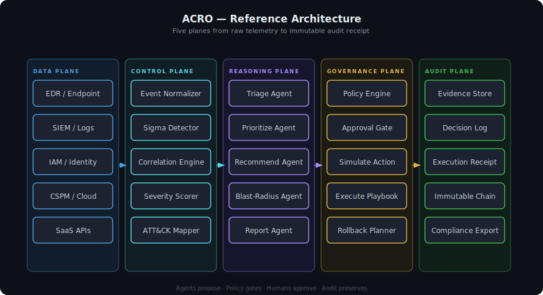

# ACRO Showcase

ACRO is a sanitized cybersecurity portfolio project demonstrating the architecture, detection logic, and response workflows behind an AI-assisted autonomous cyber response platform.

This repository is designed for recruiters, SOC managers, detection engineers, and security automation teams. It highlights multi-agent triage, event correlation, policy-governed remediation, blast-radius analysis, approval workflows, rollback planning, and immutable auditability without exposing private source code, secrets, infrastructure internals, or sensitive implementation details.

## What This Demonstrates

- Security architecture for telemetry ingestion, detection, investigation, response, and auditability
- AI-assisted multi-agent triage where agents summarize, correlate, and recommend but do not bypass deterministic controls
- Detection engineering using Sigma-style rules, normalized events, severity mapping, MITRE ATT&CK alignment, and false-positive notes
- Policy-governed response using proposal objects, Rego-style policy checks, approval gates, verification, rollback planning, and audit receipts
- Blast-radius analysis using entity relationships across identities, endpoints, cloud resources, findings, and evidence
- Product and engineering judgment through documented tradeoffs, non-goals, and safety boundaries

## What This Repository Does Not Include

- Production source code
- Secrets, credentials, API keys, or live infrastructure details
- Customer data, employee data, or real incident data
- Proprietary orchestration internals
- Offensive playbooks or unsafe exploitation instructions
- Claims of production deployment readiness or formal compliance certification

All examples use sanitized demo data, fake tenants, fake assets, fake users, and documentation-only workflows.

## Architecture Overview



Additional visual walkthroughs:

- [Reference architecture](diagrams/reference-architecture.md)
- [Agent decision flow](diagrams/agent-decision-flow.md)
- [Response governance flow](diagrams/response-governance-flow.md)
- [Blast radius flow](diagrams/blast-radius-flow.md)
- [Evidence pipeline](diagrams/evidence-pipeline.md)
- [Policy engine overview](diagrams/policy-engine-overview.md)
- [Event correlation flow](diagrams/event-correlation-flow.md)
- [Audit trail flow](diagrams/audit-trail-flow.md)
- [Investigation workspace flow](diagrams/investigation-workspace-flow.md)

## Recommended Reading Path

For a technical reviewer, start here:

1. Read this README for the project overview.
2. Review [docs/architecture.md](docs/architecture.md) for the data plane, control plane, reasoning plane, governance plane, and audit plane.
3. Review [docs/agent-workflow.md](docs/agent-workflow.md) for the AI-assisted agent boundary.
4. Review [docs/detection-and-correlation.md](docs/detection-and-correlation.md) for normalized events, correlation logic, severity scoring, and ATT&CK mapping.
5. Review [docs/response-governance.md](docs/response-governance.md) for suggest, simulate, policy-check, approve, execute, verify, rollback, and audit.
6. Review [docs/blast-radius-analysis.md](docs/blast-radius-analysis.md) for graph-based blast-radius reasoning.
7. Review [docs/lessons-learned.md](docs/lessons-learned.md) for tradeoffs, design decisions, and future improvements.

## Feature Areas

| Area | What It Shows |
|---|---|
| Incident Workspace | Timeline, evidence review, related entities, severity context, and analyst workflow |
| Agentic Triage | Specialized AI-assisted agents for explanation, prioritization, recommendations, verification, and reporting |
| Detection Engineering | Sigma-style detections, normalized event fields, ATT&CK mapping, severity, and false-positive notes |
| Event Correlation | Identity, endpoint, cloud, and SaaS events linked into a single incident narrative |
| Response Governance | Agent proposals routed through policy checks, approval gates, scoped execution, and rollback planning |
| Blast-Radius Analysis | Graph-style reasoning over affected users, hosts, cloud resources, trust paths, and business impact |
| Auditability | Evidence references, policy decisions, approval status, execution outcome, rollback notes, and immutable receipts |

## Example Artifacts

- [examples/detections/suspicious-admin-escalation.yml](examples/detections/suspicious-admin-escalation.yml)
- [examples/detections/impossible-travel-admin-login.yml](examples/detections/impossible-travel-admin-login.yml)
- [examples/events/normalized-finding-event.json](examples/events/normalized-finding-event.json)
- [examples/events/identity-events.jsonl](examples/events/identity-events.jsonl)
- [examples/policies/response-approval-policy.rego](examples/policies/response-approval-policy.rego)
- [examples/playbooks/revoke-user-session.yml](examples/playbooks/revoke-user-session.yml)
- [examples/playbooks/isolate-host.yml](examples/playbooks/isolate-host.yml)
- [examples/audit/sample-audit-receipt.json](examples/audit/sample-audit-receipt.json)

## Repository Structure

```text
.
├── README.md
├── docs/
│   ├── architecture.md
│   ├── agent-workflow.md
│   ├── detection-and-correlation.md
│   ├── response-governance.md
│   ├── blast-radius-analysis.md
│   └── lessons-learned.md
├── diagrams/
│   ├── reference-architecture.md
│   ├── agent-decision-flow.md
│   ├── response-governance-flow.md
│   ├── blast-radius-flow.md
│   ├── evidence-pipeline.md
│   ├── policy-engine-overview.md
│   ├── event-correlation-flow.md
│   ├── audit-trail-flow.md
│   └── investigation-workspace-flow.md
├── examples/
│   ├── detections/
│   │   ├── suspicious-admin-escalation.yml
│   │   └── impossible-travel-admin-login.yml
│   ├── events/
│   │   ├── normalized-finding-event.json
│   │   └── identity-events.jsonl
│   ├── policies/
│   │   └── response-approval-policy.rego
│   ├── playbooks/
│   │   ├── revoke-user-session.yml
│   │   └── isolate-host.yml
│   └── audit/
│       └── sample-audit-receipt.json
├── assets/
│   ├── diagrams/
│   │   ├── reference-architecture.svg
│   │   ├── agent-decision-flow.svg
│   │   ├── response-governance-flow.svg
│   │   ├── blast-radius-flow.svg
│   │   ├── evidence-pipeline.svg
│   │   ├── policy-engine-overview.svg
│   │   ├── event-correlation-flow.svg
│   │   ├── audit-trail-flow.svg
│   │   └── investigation-workspace-flow.svg
│   └── screenshots/
│       └── README.md
├── SECURITY.md
└── LICENSE
```

## Security Design Principles

ACRO is built around a simple principle:

AI can accelerate investigation and recommendation, but deterministic controls must govern response.

Key safeguards include:

- Tenant context on every event, finding, query, agent proposal, policy decision, and response action
- AI-assisted output grounded in evidence references, confidence, expected impact, and rollback notes
- Agents propose actions as structured data and do not directly mutate production systems
- High-risk actions routed through policy checks and human approval before execution
- Response workflows designed to suggest, simulate, policy-check, approve, execute, verify, rollback, and audit
- Public examples limited to synthetic data and sanitized documentation

## Technologies Represented

| Category | Technologies / Concepts |
|---|---|
| Frontend | Next.js, React, TypeScript, dashboard UX, incident workspace |
| Telemetry | OpenTelemetry-style collectors, OCSF-style normalization |
| Streaming | Kafka / Redpanda-style normalized event bus |
| Analytics | ClickHouse / OpenSearch-style hot analytics concepts |
| Control Plane | PostgreSQL-style tenant, approval, policy, and workflow data |
| Detection | Sigma-style rules, MITRE ATT&CK mapping, severity scoring, correlation logic |
| Policy | Open Policy Agent, Rego, approval gates, autonomy levels, kill-switch concepts |
| Graph | Neo4j-style entity relationships, blast-radius scoring, attack path context |
| Response | SOAR workflows, CACAO-style playbooks, OpenC2-style action semantics |
| AI Governance | Evidence-grounded triage, mediated tools, proposal objects, replayable decisions, audit logging |

## Lessons Learned

The strongest design choice was separating probabilistic reasoning from deterministic authority.

- Use AI for synthesis, prioritization, explanation, recommendation, and reporting.
- Use policy engines for authorization, tenancy, approval thresholds, and response safety.
- Use normalized event contracts so detections, timelines, and agent evidence share the same language.
- Use graph analysis where relationships materially improve incident understanding.
- Treat rollback planning and audit receipts as core response features, not cleanup tasks.

## Status

This is a public portfolio showcase. It is intentionally documentation-first and sanitized. The private implementation remains separate.
