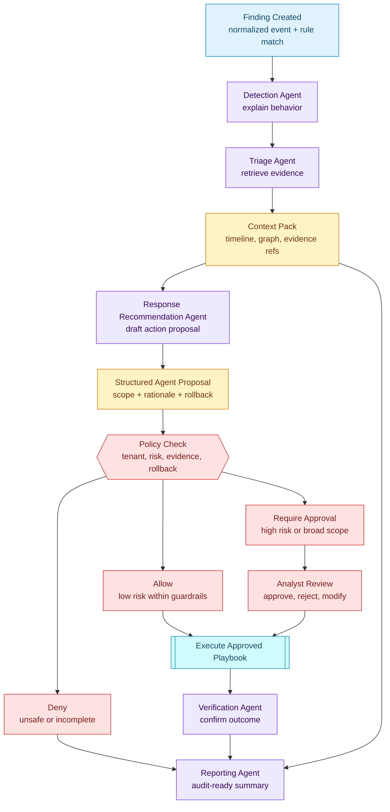

# Agent Decision Flow

This flow highlights the agent boundary. Agents can investigate, explain, and propose. The proposal becomes actionable only after deterministic policy evaluation and approval routing.

