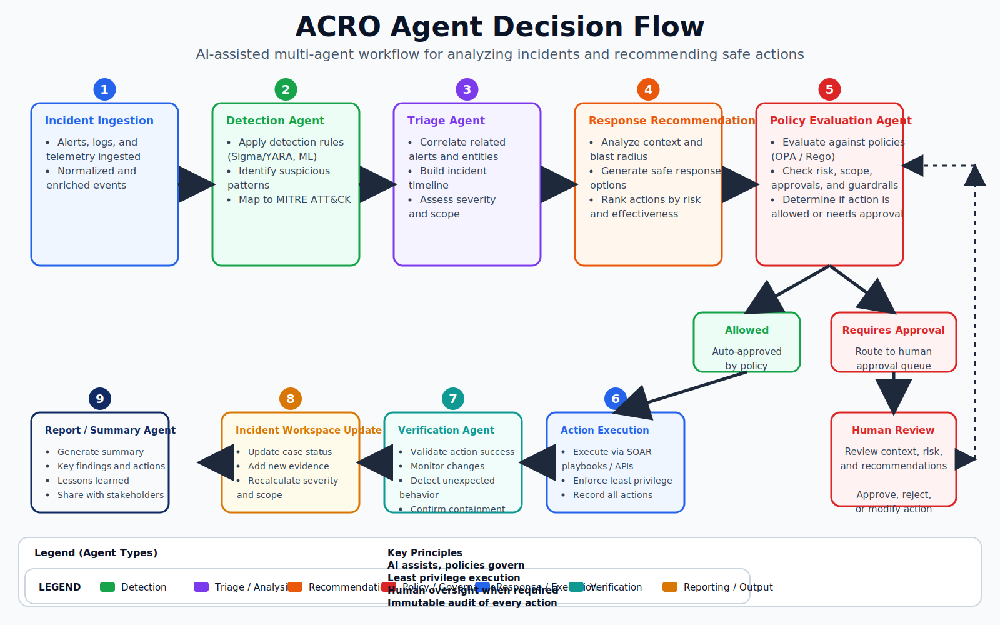

# Agent Decision Flow

This diagram shows the AI-assisted multi-agent workflow from incident ingestion through detection, triage, recommendation, policy evaluation, execution, verification, reporting, and feedback.

