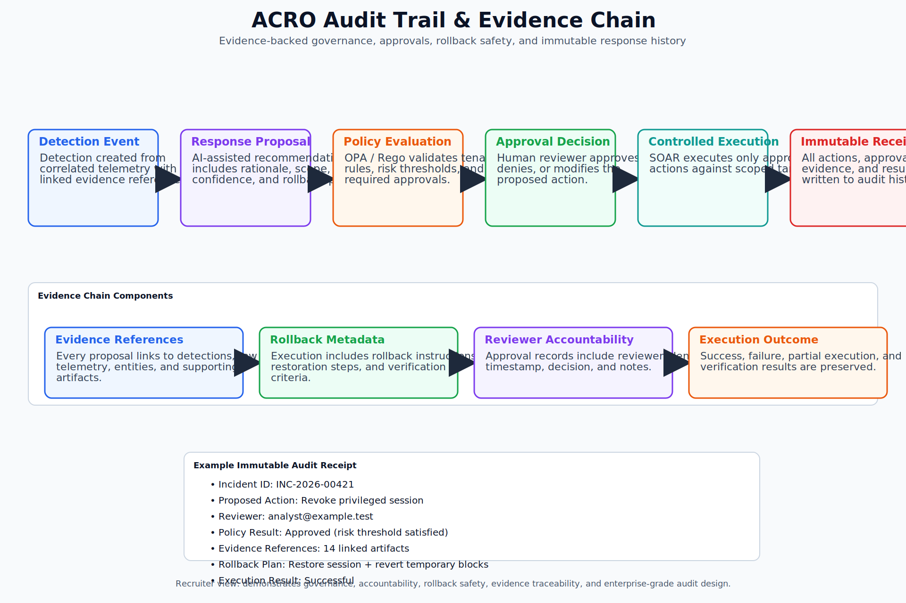

# Audit Trail And Evidence Chain

This diagram shows how detection events, response proposals, policy decisions, approvals, execution outcomes, rollback metadata, and evidence references become an immutable audit history.

