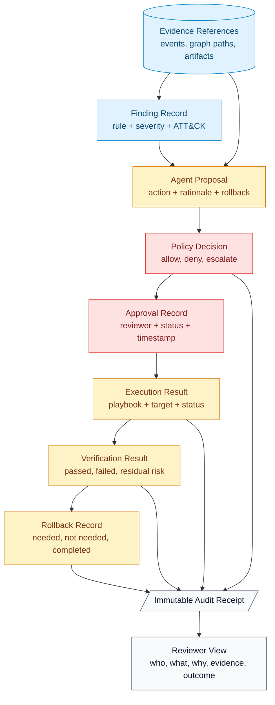

# Audit Trail Flow

The audit trail is a chain of evidence, decisions, approvals, and outcomes. It is designed for incident review, governance review, and replayable learning.

```mermaid
flowchart TB
    EVIDENCE[("Evidence References<br/>events, graph paths, artifacts")]
    FINDING["Finding Record<br/>rule + severity + ATT&CK"]
    PROPOSAL["Agent Proposal<br/>action + rationale + rollback"]
    POLICY["Policy Decision<br/>allow, deny, escalate"]
    APPROVAL["Approval Record<br/>reviewer + status + timestamp"]
    EXEC["Execution Result<br/>playbook + target + status"]
    VERIFY["Verification Result<br/>passed, failed, residual risk"]
    ROLLBACK["Rollback Record<br/>needed, not needed, completed"]
    RECEIPT[/"Immutable Audit Receipt"/]
    REVIEW["Reviewer View<br/>who, what, why, evidence, outcome"]

    EVIDENCE --> FINDING --> PROPOSAL --> POLICY --> APPROVAL --> EXEC --> VERIFY --> ROLLBACK --> RECEIPT --> REVIEW
    EVIDENCE --> PROPOSAL
    POLICY --> RECEIPT
    EXEC --> RECEIPT
    VERIFY --> RECEIPT

    classDef evidence fill:#e0f2fe,stroke:#0284c7,color:#0c4a6e
    classDef decision fill:#fef3c7,stroke:#d97706,color:#78350f
    classDef policy fill:#fee2e2,stroke:#dc2626,color:#7f1d1d
    classDef audit fill:#f8fafc,stroke:#475569,color:#0f172a

    class EVIDENCE,FINDING evidence
    class PROPOSAL,EXEC,VERIFY,ROLLBACK decision
    class POLICY,APPROVAL policy
    class RECEIPT,REVIEW audit
```
