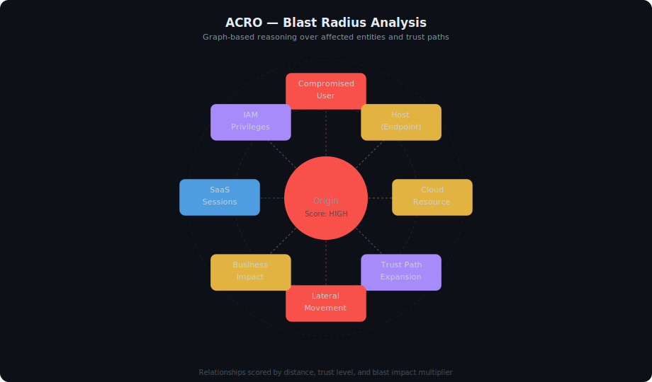

# Blast Radius Analysis Flow

This diagram shows how ACRO maps incident context into entity relationships, propagates impact across the graph, scores risk, and turns the result into response priorities.

