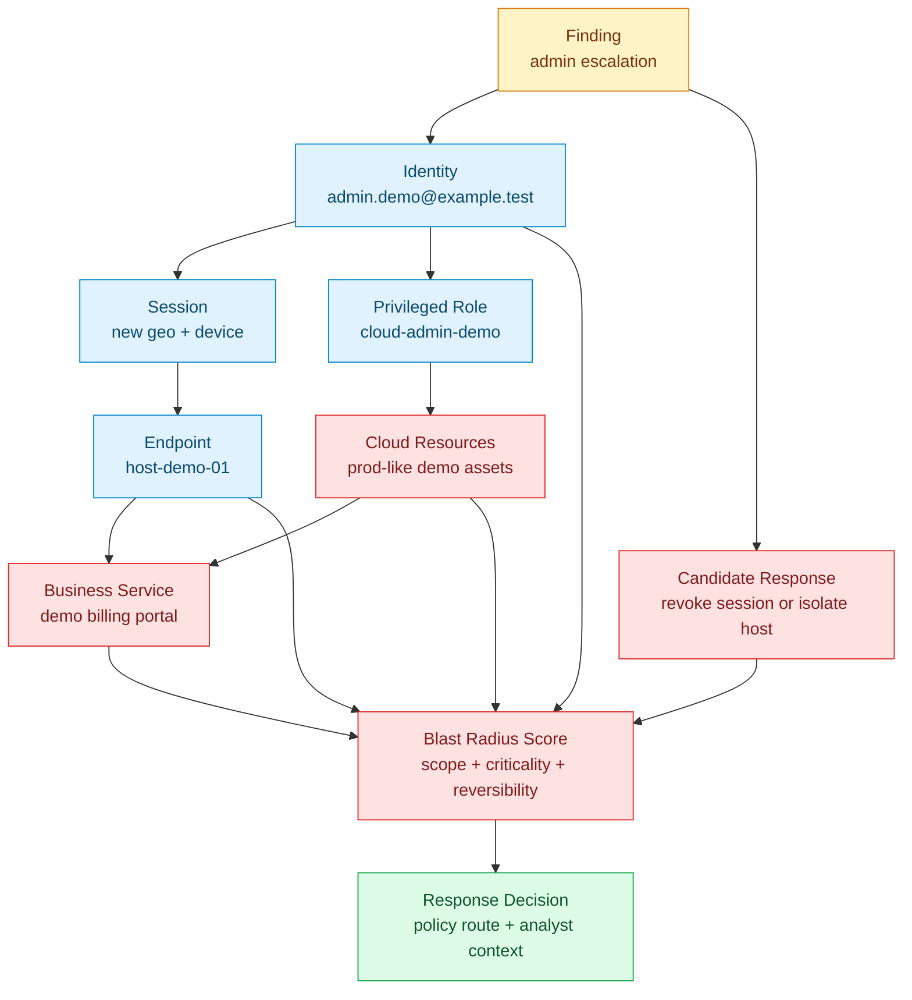

# Blast Radius Flow

Blast-radius analysis connects a finding to the people, systems, privileges, and business services that could be affected. The goal is not a bigger graph. The goal is a better response decision.

