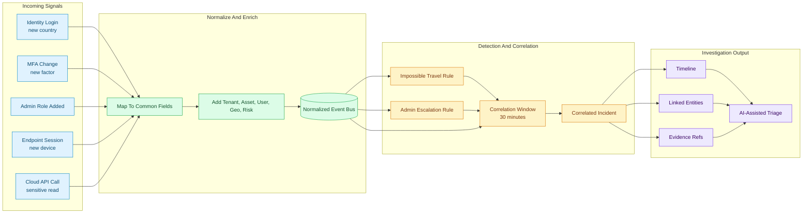

# Event Correlation Flow

This flow shows how separate signals become a single incident narrative. Correlation links identity, endpoint, and cloud events before an agent drafts a response recommendation.

