# Reference Architecture

This diagram shows ACRO as a governed response platform: telemetry becomes normalized evidence, detections become incidents, agents create proposals, policy gates response, and audit receipts preserve the chain of custody.

```mermaid
flowchart LR
    subgraph T["Telemetry Surface"]
        EDR["Endpoint<br/>process, file, network"]
        IDP["Identity Provider<br/>login, MFA, roles"]
        CLOUD["Cloud Audit<br/>IAM, resource changes"]
        SAAS["SaaS Admin<br/>data and config events"]
    end

    subgraph D["Data Spine"]
        COLLECT["Collectors"]
        OCSF["OCSF-Style Normalization"]
        BUS[("Normalized Event Bus")]
        HOT["Hot Analytics Store"]
        GRAPH[("Entity Graph")]
        VAULT[("Evidence Vault")]
    end

    subgraph C["Detection And Correlation"]
        SIGMA["Sigma-Style Rules"]
        CORR["Correlation Engine"]
        RISK["Severity + Blast Radius"]
        CASE["Incident Workspace"]
    end

    subgraph A["Agentic Triage"]
        TRIAGE["Triage Agent"]
        RESP["Response Recommendation Agent"]
        PROP["Structured Proposal"]
    end

    subgraph G["Policy Firewall"]
        OPA{{"OPA / Rego"}}
        APPROVE{"Approval Required?"}
        HUMAN["Human Approval Queue"]
    end

    subgraph R["Controlled Response"]
        PLAY[["SOAR Playbook"]]
        ACT["Scoped Actuator"]
        VERIFY["Verify + Rollback"]
    end

    subgraph AU["Audit"]
        RECEIPT[/"Immutable Audit Receipt"/]
    end

    EDR --> COLLECT
    IDP --> COLLECT
    CLOUD --> COLLECT
    SAAS --> COLLECT
    COLLECT --> OCSF --> BUS
    BUS --> HOT
    BUS --> GRAPH
    BUS --> VAULT
    HOT --> SIGMA --> CORR --> RISK --> CASE
    GRAPH --> RISK
    VAULT --> TRIAGE
    CASE --> TRIAGE --> RESP --> PROP
    PROP --> OPA --> APPROVE
    APPROVE -- "yes" --> HUMAN --> PLAY
    APPROVE -- "no" --> PLAY
    OPA -- "deny" --> RECEIPT
    PLAY --> ACT --> VERIFY --> RECEIPT
    VAULT --> RECEIPT

    classDef tele fill:#e0f2fe,stroke:#0284c7,color:#0c4a6e
    classDef data fill:#dcfce7,stroke:#16a34a,color:#14532d
    classDef detect fill:#fef3c7,stroke:#d97706,color:#78350f
    classDef agent fill:#ede9fe,stroke:#7c3aed,color:#3b0764
    classDef policy fill:#fee2e2,stroke:#dc2626,color:#7f1d1d
    classDef response fill:#cffafe,stroke:#0891b2,color:#164e63
    classDef audit fill:#f8fafc,stroke:#475569,color:#0f172a

    class EDR,IDP,CLOUD,SAAS tele
    class COLLECT,OCSF,BUS,HOT,GRAPH,VAULT data
    class SIGMA,CORR,RISK,CASE detect
    class TRIAGE,RESP,PROP agent
    class OPA,APPROVE,HUMAN policy
    class PLAY,ACT,VERIFY response
    class RECEIPT audit
```

