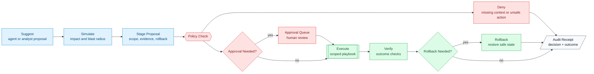

# Response Governance Flow

This diagram shows the response lifecycle from proposal to audit. The policy firewall is deliberately placed before execution so high-risk actions cannot bypass governance.

