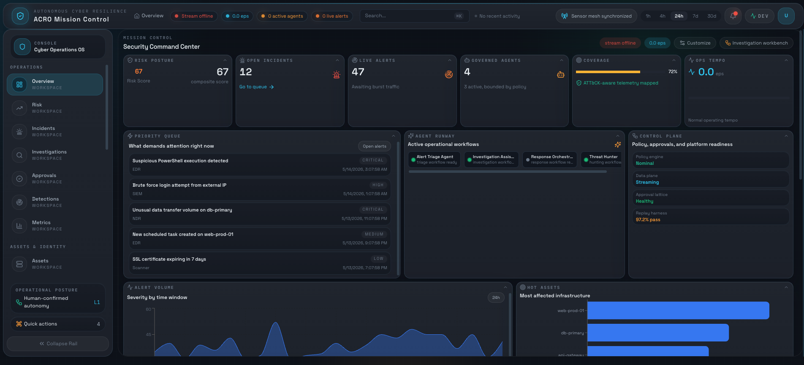
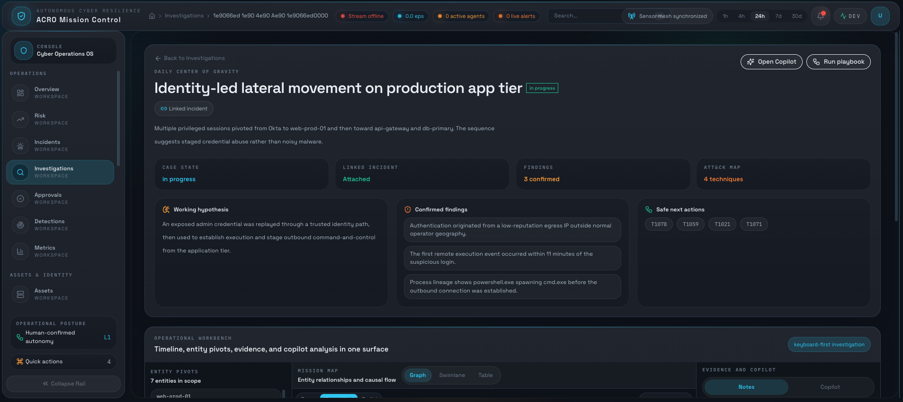
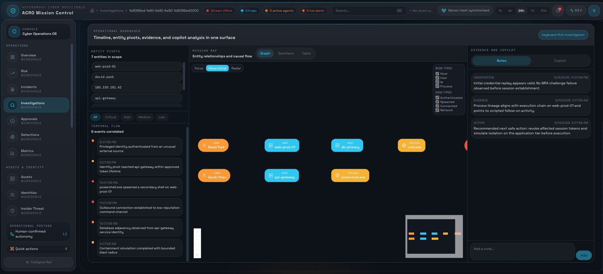
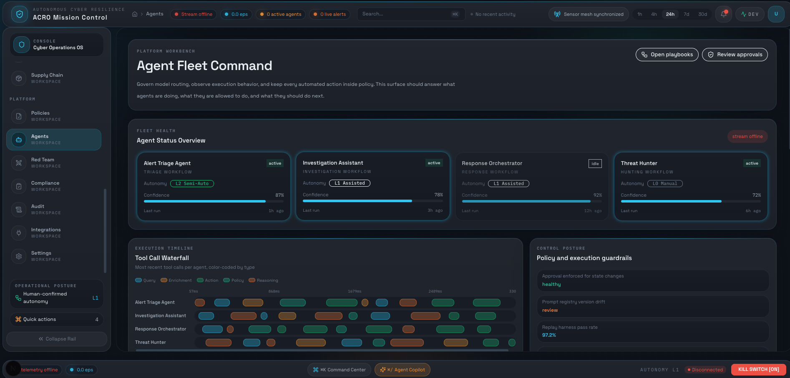
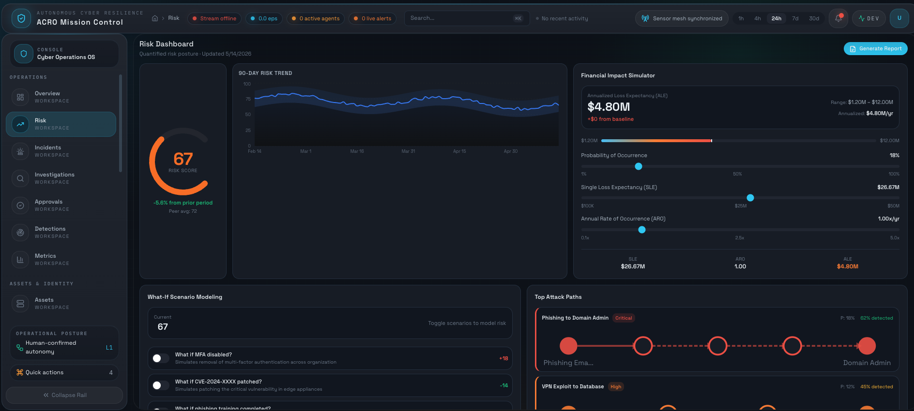
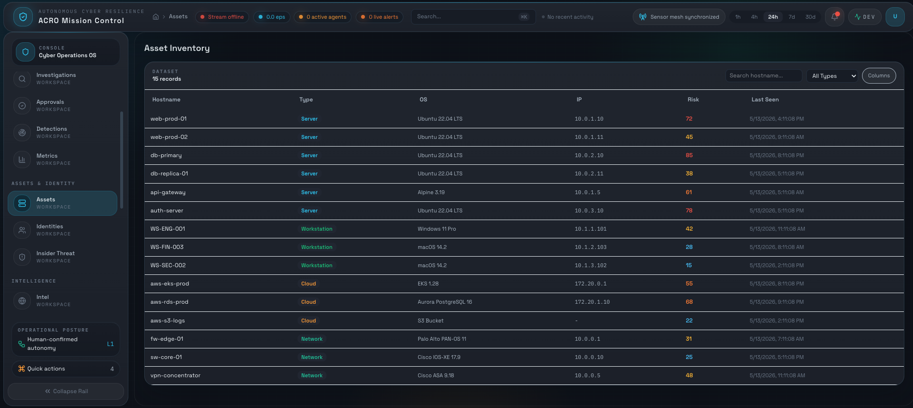
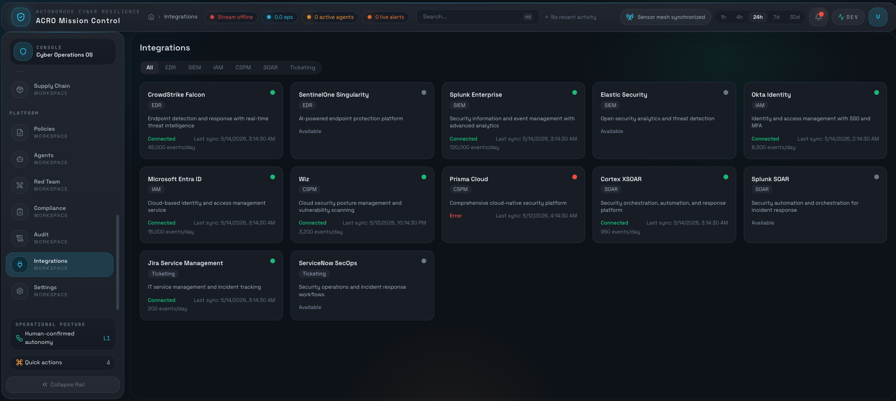
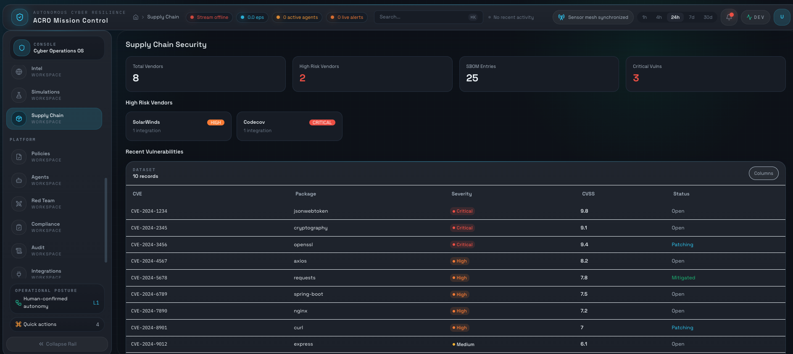

# Product Screenshot Tour

These screenshots show the ACRO demo interface using sanitized data. The goal is to help recruiters and technical reviewers quickly understand the product surfaces behind the architecture docs: dashboard operations, investigations, agent governance, risk modeling, assets, integrations, and supply-chain visibility.

No screenshots in this tour should contain customer data, private infrastructure details, secrets, credentials, API keys, or real incidents.

## Mission Control Dashboard

The dashboard gives a SOC-style overview of risk posture, incident volume, live alerts, governed agents, telemetry coverage, operational tempo, and control-plane readiness.

## Investigation Case Overview

The investigation workspace presents case state, working hypothesis, confirmed findings, ATT&CK mapping, safe next actions, and an operational workbench for timelines, entity pivots, evidence, and AI-assisted context.

## Entity Graph And Evidence Review

The graph view shows how analysts pivot through users, hosts, processes, and evidence notes while preserving context for recommendations and response governance.

## Agent Fleet Command

The agent surface emphasizes governed autonomy: agent status, autonomy level, confidence, tool-call activity, policy guardrails, and approval posture.

## Risk Dashboard

The risk view shows a quantified risk score, trend history, financial impact simulation, what-if scenario modeling, and attack-path prioritization.

## Asset Inventory

The asset inventory shows endpoint, cloud, network, and workstation records with risk values and last-seen context for investigation pivots.

## Security Integrations

The integrations view shows how ACRO could represent EDR, SIEM, IAM, CSPM, SOAR, and ticketing connectors in a single operational inventory.

## Supply Chain Security

The supply-chain view shows vendor risk, SBOM-style package inventory, vulnerability severity, CVSS scoring, and remediation status.

## Recommended Additional Screenshots

The current set is strong for a recruiter-facing overview. The main gaps to fill next are response governance and auditability:

- Response approval queue showing a proposed action, risk reason, evidence references, approval controls, and rollback summary.
- Policy decision view showing allow, deny, or require-approval output from a Rego-style policy check.
- Audit receipt view showing proposal, reviewer, policy result, evidence refs, execution status, and verification result.
- Detection engineering view showing a Sigma-style rule, ATT&CK tags, test results, and false-positive notes.
- Blast-radius graph or modal focused specifically on affected users, endpoints, cloud resources, and response impact.
- Playbook execution view showing pre-checks, execution steps, verification, and rollback status.
